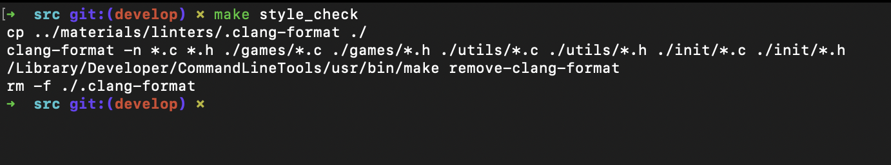
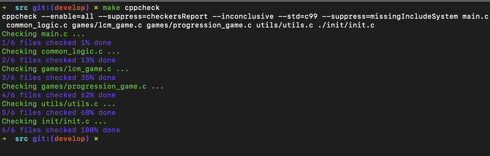

# Brain Games Project

Добро пожаловать в Brain Games! Этот проект содержит набор развлекательных и образовательных игр, которые помогут вам потренировать ваш мозг. Игры реализованы на языке C и предназначены для того, чтобы предложить простые, но увлекательные задачи для игроков любого возраста.

## Описание

"Brain Games" включает несколько игр, которые работают через консоль. На данный момент доступны две основные игры:

1. **Игра НОК (Наименьшее Общее Кратное)**: В этой игре вам предлагаются три случайных числа, и ваша задача — вычислить и указать их наименьшее общее кратное.

2. **Игра Прогрессия (Геометрическая Прогрессия)**: В этой игре вам показывается последовательность чисел, образующих геометрическую прогрессию. Одно из чисел в последовательности скрыто, и ваша задача — определить пропущенное значение.

Игроки могут продолжать играть раунды в каждой игре до тех пор, пока не решат вернуться в главное меню. Проект организован модульным образом, что позволяет в будущем добавлять больше игр.

## Структура каталогов

```
mrpo_game/
├── materials/
|   ├── images                   # Папка для скриншотов
|   └── linters                  # Папка с конфигурацией clan-format
|
├── src/                         # Папка с основными скриптами
|   ├── Makefile                 # Makefile для компиляции проекта
|   ├── main.c                   # Основная точка входа в проект
|   ├── common_logic.c           # Содержит общую логику, используемую во всех играх
|   ├── common_logic.h           # Заголовочный файл для common_logic.c
|   ├── games/                   # Каталог, содержащий файлы отдельных игр
|   │   ├── lcm_game.c           # Игра "Наименьшее Общее Кратное (НОК)"
|   │   ├── progression_game.c   # Игра "Геометрическая Прогрессия"
|   │   └── games.h              # Заголовочный файл для всех игр, экспонирующий их интерфейсы
|   ├── init/                    # Каталог для инициализационных процедур
|   │   ├── init.c               # Логика, связанная с инициализацией
|   │   └── init.h               # Заголовочный файл для init.c
|   ├──utils/                    # Каталог для вспомогательных функций
|   |   ├── utils.c              # Содержит различные вспомогательные функции (например, генерация случайных чисел)
|   |   └── utils.h              # Заголовочный файл для utils.c
|
└── README.md                    # Описание проекта
```

## Начало работы

Чтобы запустить проект Brain Games локально, выполните следующие шаги:

### Необходимое ПО
- Компилятор GCC (`gcc`)
- Утилита `make`
- Терминал Linux или macOS (или аналогичная оболочка)

### Установка

1. Клонируйте репозиторий на свой локальный компьютер:
   ```sh
   git clone git@github.com:outtathe/mrpo_game.git
   cd mrpo_game
   cd src
   ```

2. Скомпилируйте проект, используя `make`:
   ```sh
   make
   ```

### Запуск игры

После компиляции вы можете запустить игру, выполнив следующую команду:
   ```sh
   ./brain_games
   ```

### Очистка

Для очистки файлов сборки используйте следующую команду:
   ```sh
   make clean
   ```

## Управление игрой

- Когда вам предлагается выбрать игру, введите `1` для **Игры НОК**, `2` для **Игры Прогрессия** или `3`, чтобы **выйти** из игры.
- Во время игры отвечайте на предложенные вопросы.
- После каждого раунда вас спросят, хотите ли вы продолжить игру (`y/n`). Введите `y`, чтобы продолжить, или `n`, чтобы вернуться в главное меню.

## Asciinema с геймплеем


## Работа линтеров

# Результат работы **clang-format**
Результат проверки кода на соответствие стилю с помощью линтера **clang-format**


# Результат работы **cppcheck**
Результат проверки кода на чекеры **cppcheck**:


В данном случае, линтер **cppcheck** проверяет на:
- утечки памяти
- налииче ошибок
- нарушение стандартов
- уязвимости в безопасности
- стилевые нормы
## Лицензия
Этот проект является открытым и свободным для использования.

---

Наслаждайтесь играми и держите свой ум в тонусе!